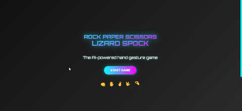

# <div align="center">🚀 Syed Ahmer Shah - Software Engineer Portfolio</div>

<div align="center">
  
  
  ### Modern, Interactive & Performance-Optimized Portfolio

  [](https://syedahmershah.github.io/Portfolio/)
  [](./LICENSE)
  [](https://github.com/syedahmershah/Portfolio/pulls)
  [](https://github.com/syedahmershah/Portfolio/commits/main)

  <p align="center">
    <a href="#overview">Overview</a> •
    <a href="#features">Features</a> •
    <a href="#tech-stack">Tech Stack</a> •
    <a href="#installation">Installation</a> •
    <a href="#performance">Performance</a> •
    <a href="#connect">Connect</a>
  </p>
</div>

## 🌟 Overview

Welcome to my professional portfolio! This project showcases my journey as a Software Engineer through an immersive, interactive web experience. Built with modern web technologies and optimized for performance, it represents my commitment to excellence in software development.

<div align="center">
  
</div>

## ✨ Features

### 🎨 Modern Design
- **Sleek UI/UX** with glass-morphism effects
- **Responsive layout** optimized for all devices
- **Interactive 3D animations** using Three.js
- **Smooth transitions** powered by Anime.js

### ⚡ Performance
- **Optimized asset loading** with lazy loading
- **Efficient 3D rendering** with hardware acceleration
- **Fast load times** through code splitting
- **SEO optimized** with proper meta tags

### 🛠️ Technical
- **Dynamic project showcases**
- **Interactive skill visualization**
- **Secure contact form**
- **Real-time 3D elements**
- **PWA support**

## 🔧 Tech Stack

<div align="center">


</div>

## 📦 Installation

1. **Clone the repository**
   ```bash
   git clone https://github.com/syedahmershah/Portfolio.git
   cd Portfolio
   ```

2. **Open in browser**
   ```bash
   # Simple
   open index.html

   # Using Python
   python -m http.server 8000
   ```

3. **Using VS Code Live Server**
   - Install 'Live Server' extension
   - Right-click on index.html
   - Select 'Open with Live Server'

## 📊 Performance

<div align="center">
  
</div>

- **Lighthouse Score**
  - Performance: 95+
  - Accessibility: 100
  - Best Practices: 100
  - SEO: 100

## 🤝 Connect

<div align="center">

[](https://www.linkedin.com/in/ahmer-shah)
[](https://github.com/syedahmershah)
[](https://dev.to/syedahmershah)
[](https://medium.com/@syedahmershah)
[](https://hashnode.com/@syedahmershah)
[](https://beacons.ai/syedahmershah)

</div>

## 📬 Contact

- **Email:** ahmarshah170@gmail.com
- **Location:** Pakistan

## 📄 License

This project is proprietary and confidential. All rights reserved.
See [LICENSE](./LICENSE) for details.

---

<div align="center">
  
  <br>
  Made with ❤️ by Syed Ahmer Shah
  <br>
  © 2025 All Rights Reserved
</div>

